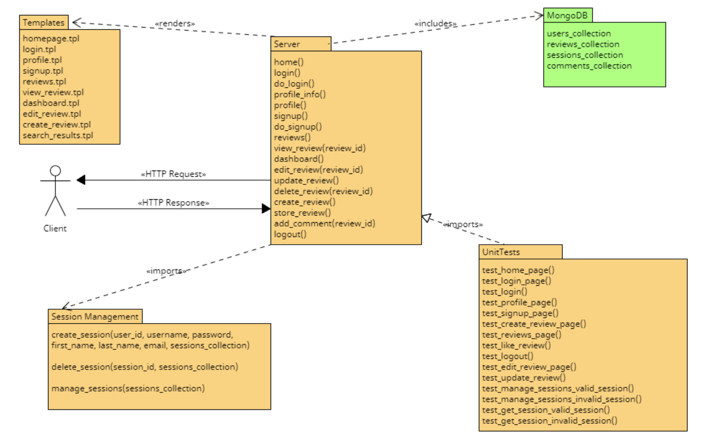

# Component Architecture Document

## Overview
This document provides an architecture overview of a web application built using the Bottle framework in Python. The application's primary focus is on user authentication, session management, and various user interactions, including login, signup, review creation, editing, deletion, and comment addition.

### UML Diagram:

## Components

### 1. Web Application (Server)

- **Responsibility**: This component serves as the core of the application, handling HTTP requests and responses, routing to the appropriate views, and managing user sessions.
- **Key Functions**:
  - `home()`: Renders the homepage template.
  - `login()`: Renders the login template.
  - `do_login()`: Handles user login and redirects to the dashboard upon success.
  - `profile_info()`: Manages the user's profile information.
  - `profile()`: Renders the user profile page.
  - `signup()`: Renders the signup template.
  - `do_signup()`: Handles user registration.
  - `reviews()`: Lists available reviews.
  - `view_review(review_id)`: Displays a specific review and associated comments.
  - `dashboard()`: Displays the user's dashboard with their reviews.
  - `edit_review(review_id)`: Allows editing a review.
  - `update_review()`: Handles review updates.
  - `delete_review(review_id)`: Handles review deletions.
  - `create_review()`: Renders the create_review template.
  - `store_review()`: Handles the creation of new reviews.
  - `add_comment(review_id)`: Allows users to add comments to reviews.
  - `logout()`: Logs the user out and clears the session.
  
### 2. MongoDB Database

- **Responsibility**: This component stores user data, review data, and session information in a MongoDB database.
- **Key Collections**:
  - `users_collection`: Stores user information, including username, password, first name, last name, and email.
  - `reviews_collection`: Stores review data, including titles, content, likes, and dislikes.
  - `sessions_collection`: Stores session data for user authentication and session management.
  - `comments_collection`: Stores comments associated with reviews.

  
### 3. Templates

- **Responsibility**: This component is responsible for rendering HTML templates to present information to the user and handle user interactions.
- **Key Views and Templates**:
  - 'homepage.tpl': Main page when opening the website.
  - 'login.tpl': Login page.
  - 'profile.tpl': User profile page.
  - 'signup.tpl': Signup page.
  - 'reviews.tpl': Reviews page.
  - 'view_review.tpl': View a single review.
  - 'dashboard.tpl': User dashboard page.
  - 'edit_review.tpl': Edit a review.
  - 'create_review.tpl': Create a new review.
  - 'search_results.tpl': Display search results.

### 4. Session Management

- **Responsibility**: Manages user sessions and session-related functions.
- 
- **Key Functions**:
  - `create_session(user_id, username, password, first_name, last_name, email, sessions_collection)`: Creates a new user session and sets a session cookie in the response.
  - `delete_session(session_id, sessions_collection)`: Deletes a user session.
  - `manage_sessions(sessions_collection)`: Manages user sessions and acts as a hook to perform session-related tasks.

### 5. Unit Tests

- **Responsibility**: Ensuring the functionality and behavior of various components within the web application through automated testing.

- **Key Test Cases**:
  - `test_home_page()`: Tests the homepage route.
  - `test_login_page()`: Tests the login page route.
  - `test_login()`: Tests user login functionality.
  - `test_profile_page()`: Tests the user profile page route.
  - `test_signup_page()`: Tests the signup page route.
  - `test_create_review_page()`: Tests the create review page route.
  - `test_reviews_page()`: Tests the reviews page route.
  - `test_like_review()`: Tests the "like" functionality for reviews.
  - `test_logout()`: Tests user logout functionality.
  - `test_edit_review_page()`: Tests the edit review page route.
  - `test_update_review()`: Tests updating a review.

## Component Interactions

1. A user accesses the web application through a web browser.

2. The web application (Bottle) receives HTTP requests from the user.

3. When a request is received, the web application routes the request to the appropriate view or function based on the URL path.

4. Views and templates render HTML pages for the user to interact with.

5. The application uses MongoDB to store and retrieve user data, reviews, and session information.

6. Session management functions handle user authentication and session creation, while hooks manage user sessions throughout the application.

7. Views and templates interact with the MongoDB database to retrieve review data and comments for rendering.

8. Users can perform actions such as logging in, signing up, creating, editing, or deleting reviews, and adding comments to reviews.

9. Session data is stored in the MongoDB collection designated for sessions, and session cookies are set in the user's browser.

10. User data is retrieved from the database for authentication and personalization.

## Conclusion

This component architecture document outlines the various components, their responsibilities, and interactions in the web application.
The components work together to provide user authentication, session management, and features for creating and managing reviews and comments.
MongoDB is used to store and retrieve data, while the Bottle framework handles routing and view rendering.

