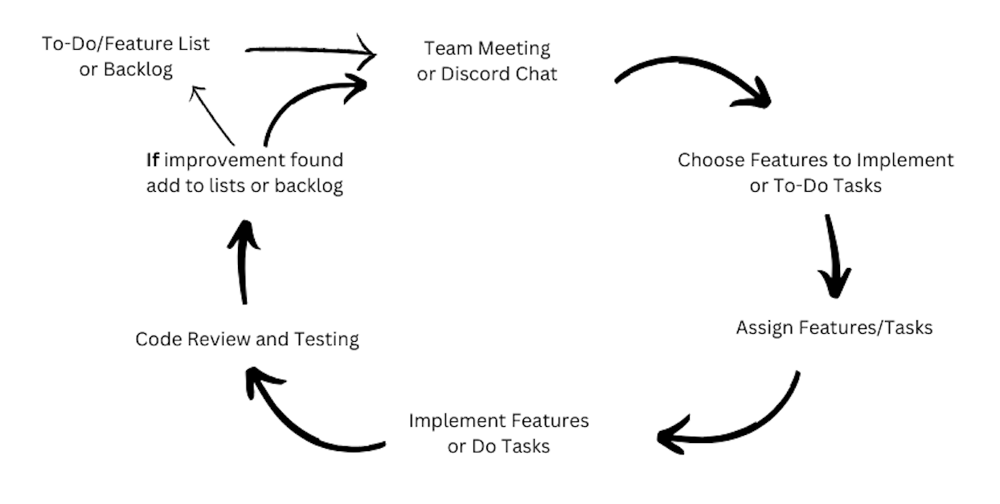

# Process Model Analysis Document
This document explains the process the team goes through when working on a sprint.

**What does this document contain?**
* The process is display in a diagram format
* Each component of the process is explained
* The changes we made since the beginning of the project
* Ideas for improving our process and what we will do about it

### Process Model Diagram:

### Elements of Process:
* **To-Do/Feature List and Backlog**: The process starts with the existence of a to-do/feature list and a backlog of tasks. This is where potential features or tasks are documented.

* **Team Meeting**: The team conducts regular meetings to discuss the next two processes.

* **Choosing Features and Tasks**: During the meeting the team chooses the features and tasks to prioritize next. 

* **Task Assignment**: After choosing features or tasks, the team assigns these tasks to individual team members. This step helps in distributing the workload effectively.

* **Implementation**: Team members work on implementing the chosen features or tasks. This is where the actual development work takes place.

* **Code Review and Testing**: After implementation, there is a phase for code review. This is a critical step to ensure code quality, maintainability, and adherence to coding standards. The code is also tested to identify any defects or issues. This ensures that the software functions correctly and meets requirements.

* **Improvement and Iteration**: If issues or areas for improvement are identified during the testing phase, they are added to the to-do/feature list or backlog. This process creates a feedback loop for continuous improvement.

### Old Process:
The most significant change in your our since the beginning of the project is the introduction of code review and testing. In your initial process, we did not have these critical phases. By incorporating code review and testing, we have enhanced the quality of your software development process. This change allows us to catch issues early, improve code quality, and reduce the likelihood of defects in the final product.

Additionally, our initial process didn't explicitly mention a feedback loop for improvements. In the current process, if issues are found during code review or testing, they are added to the to-do/feature list or backlog, which helps in addressing them in a more organized manner.

These were the only improvements made for our process model. Everything else remained the same.

### Improvement:

One area of improvement our team thought of was to add the process of **updating any documentation such as ReadMe, Attributions, and Docstrings once have finished our code review and testing phase.**
This would help with these documents being continuously updated throughout the sprint. Now that sprint 2 is coming to an end, we are noticing that these tasks have added up for us and we have a lot of work to go back and update these documents before sprint deadline.
We feel that the rest of our process is running very smoothly now after our improvements from the first sprint besides this one addition. We will add this to the process of our code going forward.
